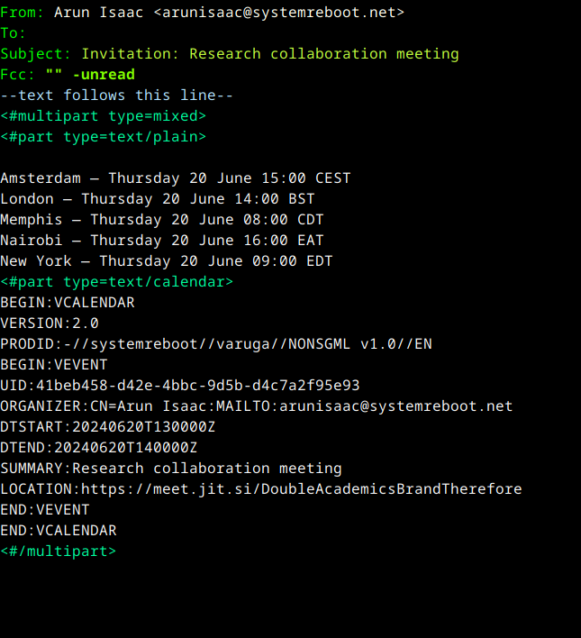

[](https://melpa.org/#/varuga)

Send ical calendar invites using your Emacs mail client. These
invites are similar to those produced by Google Calendar, Outlook
Calendar, etc. and are compatible with them.

varuga populates a message mode buffer with an ical MIME part (using
MML, the MIME Meta Language). It also adds a plain text part listing
the time of the event in various configured timezones.

All dates and times you enter into varuga are in your local timezone. varuga automatically converts these into a set of configured timezones (specified in `varuga-clock-list`) for your correspondents' benefit.

🙏 வருக வருக! (varuga varuga!) is a Tamil expression that is used to warmly welcome people to an event.

# Installation

varuga is available from [MELPA](https://melpa.org/#/varuga).

# How to use

In a message mode buffer, run `M-x varuga-invite`, and enter the event details. The email will be filled out with the ical and plain text parts. Add any other text you like and send!



# Natural language date-time and event duration specification

varuga uses the very flexible `org-read-date` to read the date and
time of the event from a natural language
specification. `org-read-date` assumes that most of the time you want
to enter a date in the future: if you omit the month/year and the
given day/month is *before* today, it assumes that you mean a future
date. See [*The date/time prompt* in the Org mode manual](https://orgmode.org/manual/The-date_002ftime-prompt.html) for more details. Here are a few examples of date-time specifications. All the examples below assume that the current date-time is June 16, 2024 7 am.
```
25-2-5 1pm      ⇒ 2025-02-05 1300
2/5/25 1am      ⇒ 2025-02-05 0100
14 4pm          ⇒ 2024-07-14 1600
2/5 3pm         ⇒ 2025-02-05 1500
Fri 2pm         ⇒ 2pm next Friday
Friday 2pm      ⇒ Same as above
sep 15 9am      ⇒ 2024-09-15 0900
feb 15 10am     ⇒ 2025-02-15 1000
sep 12 2029 7am ⇒ 2029-09-12 0700
12:45           ⇒ 2024-06-16 12:45
22 sep 0:34     ⇒ 2024-09-22 0:34
w4              ⇒ Monday of ISO week 4 of the current year 2024
2025 w4 fri     ⇒ Friday of ISO week 4 in 2025
2025-w04-5      ⇒ Same as above
```

varuga uses `org-duration` to read durations in natural language. Here are a few examples of valid durations.
```
3:12
1:23:45
1h 30 min
1y 3d 3h 4min
1d3h5min
3d 13:35
2.35h
```

# Running tests

You may run tests using
```
make check
```

# License

varuga is free software released under the terms of the [GNU General Public License](https://www.gnu.org/licenses/gpl.txt), either version 3 of the License, or (at your option) any later version.
